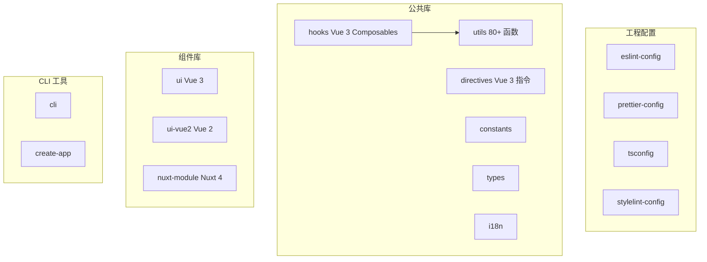
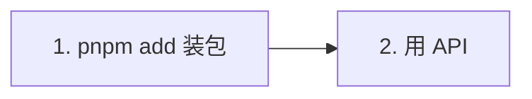

# ku-utils 公共库历程

## 整场结构


---

## 一、开场

### 演讲要点（口播）

- **ku-utils** 前端团队的公共库，沉淀团队工程能力，基于 pnpm v10 workspace + Turborepo v2 构建
- 包以 `@ku-utils/*` **public** 发布到 npmjs.org，覆盖 **15 个可发布包 + 2 个 CLI 工具**

### 库文档

- 浏览器打开 VitePress 文档站首页：`pnpm --filter @ku-utils/docs dev` → `http://localhost:5173`

### 为什么叫 ku-utils

- A：ku = 团队公共能力前缀，utils = 工具与工程基础设施

---

## 二、为什么做

### 演讲要点

我们之前有 **3 个旧库散落各处**：

1. **du-utils**：通用工具混杂业务追踪，有 70+ 文件
2. **xh-report**：埋点上报 SDK，npm workspaces 内含 sdk + landing 两个包
3. **hela-pay**：Web 支付 SDK

这 3 个库都有共性问题：

- **file tar.gz 依赖**
- **重复造轮子**
- **无统一规范**
- **发版繁琐**
- ***

## 三、整体架构

### 演讲要点

ku-utils 用 **pnpm v10 workspace + Turborepo v2** 组织，分 4 大类：



**关键设计决策**：

- 单向依赖、无环：utils 是底层基础
- tsup 统一打包，所有 workspace 依赖在 external 中标记，dist 体积保持精简
- 严格的 patch 位规则：禁止为 0（避免与 npm 内部缓存冲突），新 minor / major 从 .1 起
- 三种业务类型全覆盖：Vue 2 / Vue 3 / Nuxt 4

### FAQ 锦囊

- Q：utils 跟 lodash 是什么关系？A：utils 是我们自己实现 + 优选 lodash 部分能力（`mergeWith` 等）；不强制 re-export，业务方需要 lodash 自行装
- Q：为什么不用 npm/yarn workspace？A：pnpm 严格的 phantom dependency 检测对 monorepo 更友好

---

## 四、关键能力演示

### 4.1 utils

> 80+ 纯函数，零框架依赖，可在 Vue 2 / Vue 3 / Nuxt / Node 任何环境用

演示：

```typescript
import {
  formatThousands,
  formatDate,
  doDate,
  parseUrlParam,
  appendUrlParams,
  getBrowserInfo,
  isWechat,
  setCopy,
  doUUID,
  generateUUID,
  ktk,
  uuid,
  useToken,
  doExtend,
  deepMerge,
  cherrySetId,
  validatePassword,
  createLogger,
} from '@ku-utils/utils';

formatThousands('1234567.89'); // '1,234,567.89'
doDate(Date.now(), 'dateTime'); // '2026-04-17 10:30:45'
parseUrlParam(location.href, 'utm_source'); // 'fb_ad'（兼容 hash 内 query）
isWechat(); // 微信 UA 检测
await setCopy('hello'); // Clipboard API + execCommand 降级
const tk = useToken('com.example.app'); // 与包名关联的持久化 Token
```

**FAQ**：utils 文件 80+ 函数怎么找？→ 用 IDE 自动补全 `import { } from '@ku-utils/utils'`

---

## 五、业务接入路径

### 三步搞定



### 详细步骤

**Step 1**：从 npm 安装即可，详见 [从 npm 安装](/guide/npm) 与 [发布到 npm](/npm-publish)。

公开包直接：

```bash
pnpm add @ku-utils/utils
```

### 真实接入案例

- 已接入项目：`apps/playground-vue3`、`apps/kv3-admin`（本仓验证）
- 接入耗时：< 30 分钟（npm 装包 + 替换导入）

### FAQ 锦囊

- Q：能不能 `npm install` 而不是 `pnpm`？A：可以，但本仓与消费方建议用 pnpm。

---

## 六、未来规划

### Roadmap

| 优先级 | 项               | 说明                                                                |
| ------ | ---------------- | ------------------------------------------------------------------- |
| **P0** | 测试覆盖率提升   | 当前 utils 有测试覆盖，持续提升到 60%                               |
| **P0** | changeset 规范化 | 当前每次 commit + 手动改版本号；引入 changeset 自动管理 CHANGELOG   |
| **P1** | Skills 体系      | `.cursor/skills/` 沉淀「新增包」、「迁移业务到 ku-utils」等 AI 助手 |
| **P1** | pix-landing 落地 | 飞书需求文档已下达，将作为业务落地页标杆（不纳入本仓 SDK）          |
| **P2** | 文档站灰度发布   | GitHub Pages 或任意静态托管 + 团队飞书机器人推送                    |
| **P2** | UI 组件库扩充    | 当前 4 个组件（Button/Modal/Empty/StatusTag），目标 20+             |

### 团队协作约定

- 「周会」，同步进度 + 收集业务方需求
- 每个新增包必须：源码 + tsup 配置 + README + docs/packages 页面
- Commit message 强制中文 + commitlint 校验
- 每次发版后在 playground / kv3-admin 验证

---

## 七、Q&A 准备

### 高频问题预案

**Q1：为什么不直接用社区的 lodash / dayjs / mitt？**
A：utils 内部该用就用（如 mergeWith 自实现成本高），但**对外不强制吃整套依赖**。业务方可按需自装；utils 自身只暴露我们经过筛选 + 包了团队语义的 API。

**Q2：包是不是太多了，有必要拆这么细吗？**
A：本质是「单一职责」+「按需装载」+「依赖可控」。比如纯静态站只需要 `@ku-utils/utils`，不会把 `@ku-utils/ui` 或 `@ku-utils/hooks` 拖进来。

**Q3：业务想要的能力 ku-utils 没有怎么办？**
A：3 种路径：

1. 在业务项目自己实现 → 跑通后提 PR 到 ku-utils
2. 提 issue 到 ku-utils 仓库，下个迭代周会评估
3. 紧急需求联系我直接开 hotfix 分支

**Q4：发布到 npm 的版本怎么管？**
A：用 Changesets：`pnpm changeset` 记录变更，合入 `main` 后由 GitHub Actions 升版并 `changeset publish`。业务方通过版本号与 CHANGELOG 反推改动。

**Q6：CLI 工具能做什么？**
A：`@ku-utils/create-app` 一键拉模板创建项目；`@ku-utils/cli` 提供 `init` 注入工程配置、`doctor` 健康检查。详见 [docs/cli/overview.md](./cli/overview.md)。

---

## 附录：演讲准备清单（演讲前 1 小时检查）

- [ ] `pnpm --filter @ku-utils/docs dev` 启动文档站，浏览器预热
- [ ] 先`pnpm format` + `pnpm lint:fix` 一遍
- [ ] 再 `pnpm typecheck` + `pnpm build` 一遍
